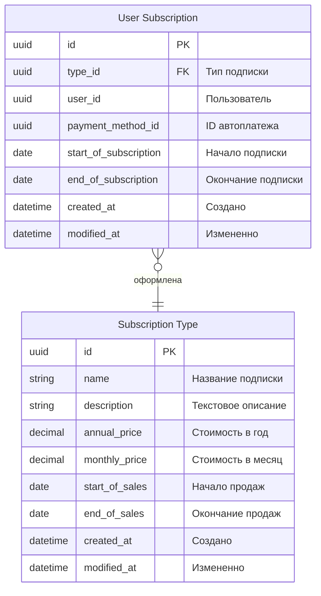

# ERD

```mermaid
erDiagram
    subscription-type["Subscription Type"] {
        uuid id PK
        string name "Название подписки"
        string description "Текстовое описание"
        decimal annual_price "Стоимость в год"
        decimal monthly_price "Стоимость в месяц"
        date start_of_sales "Начало продаж"
        date end_of_sales "Окончание продаж"
        datetime created_at "Создано"
        datetime modified_at "Измененно"
    }
    
    user-subscription["User Subscription"] {
        uuid id PK
        uuid type_id FK "Тип подписки"
        uuid user_id "Пользователь"
        uuid payment_method_id "ID автоплатежа"
        date start_of_subscription "Начало подписки"
        date end_of_subscription "Окончание подписки"
        datetime created_at "Создано"
        datetime modified_at "Измененно"
    }

    user-subscription }o--|| subscription-type : "оформлена"

```