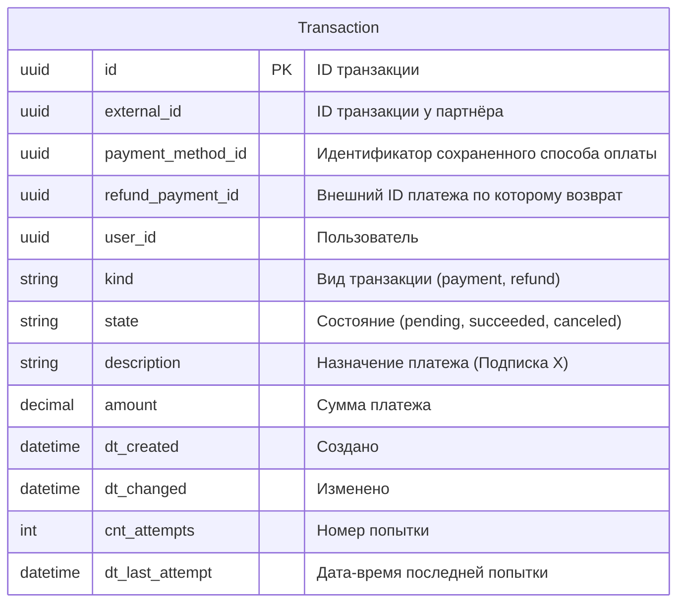

# ERD

Поле payment_method_id по сути идентифицирует автоплатёж по конкретной подписке

Поле refund_payment_id заполняется только для Транзакций action == refund и в нём
указывается внешний ID того платежа, по которому сделан возврат

При этом, поле payment_method_id также заполняется, если отменяемый платёж
был периодическим (с автопродлением)
