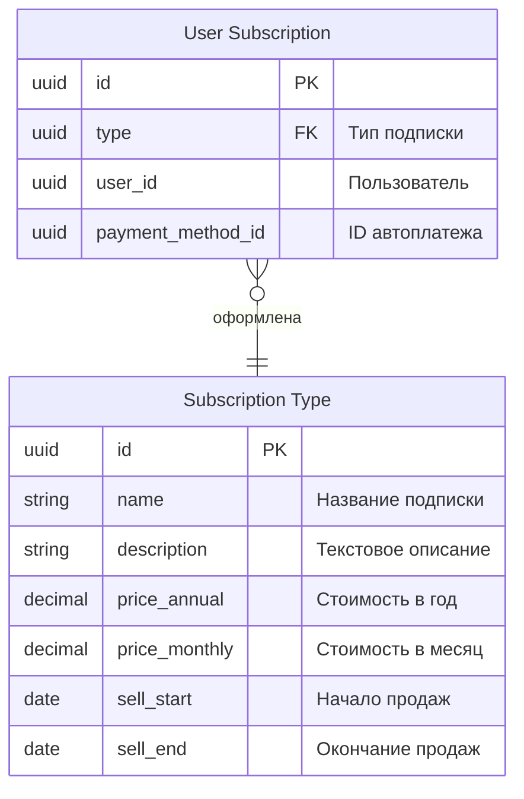

# ERD

```mermaid
erDiagram
    subscription-type["Subscription Type"] {
        uuid id PK
        string name "Название подписки"
        string description "Текстовое описание"
        decimal price_annual "Стоимость в год"
        decimal price_monthly "Стоимость в месяц"
        date sell_start "Начало продаж"
        date sell_end "Окончание продаж"
    }
    
    user-subscription["User Subscription"] {
        uuid id PK
        uuid type FK "Тип подписки"
        uuid user_id "Пользователь"
        uuid payment_method_id "ID автоплатежа" 
    }

    user-subscription }o--|| subscription-type : "оформлена"

```