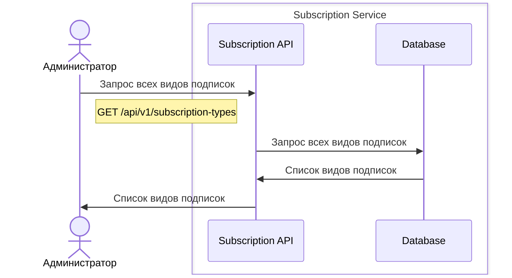
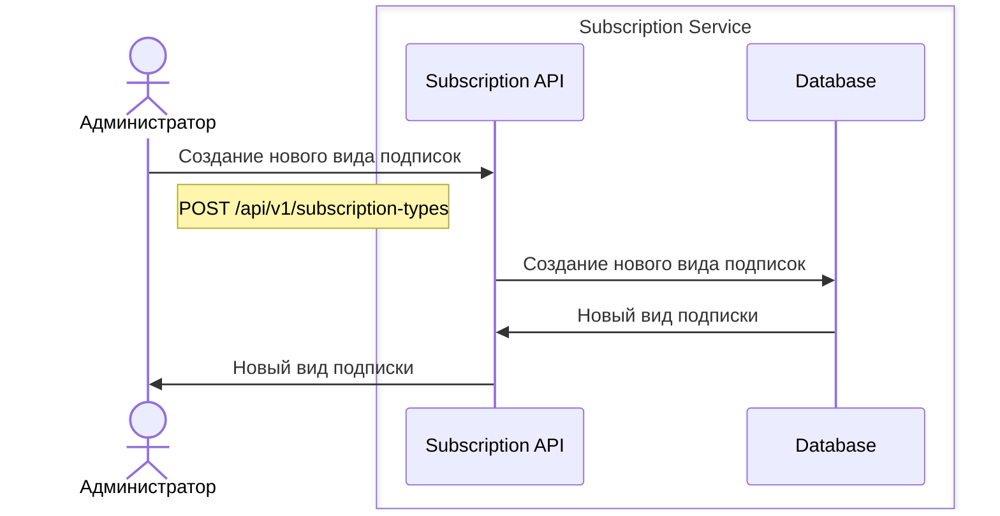
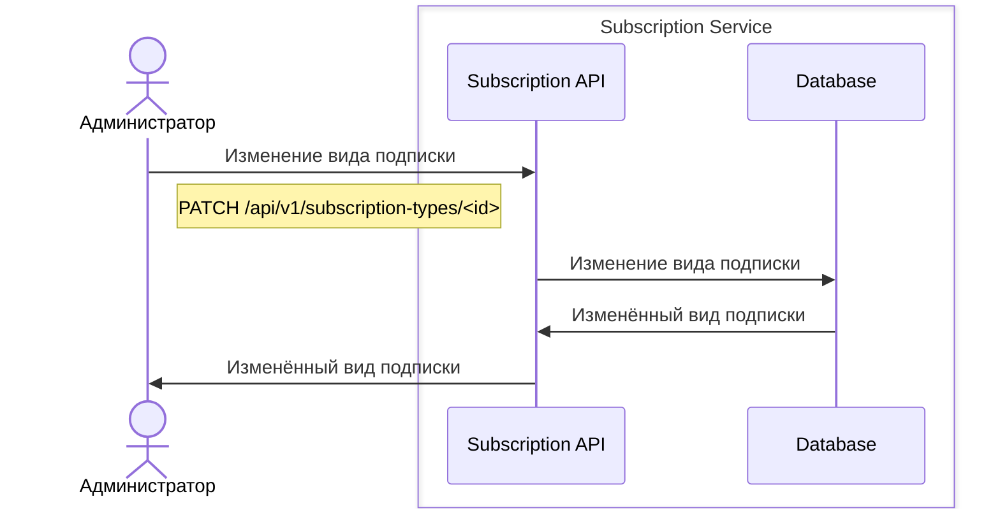
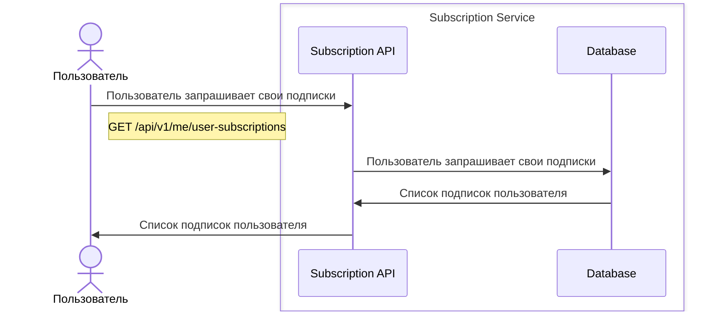
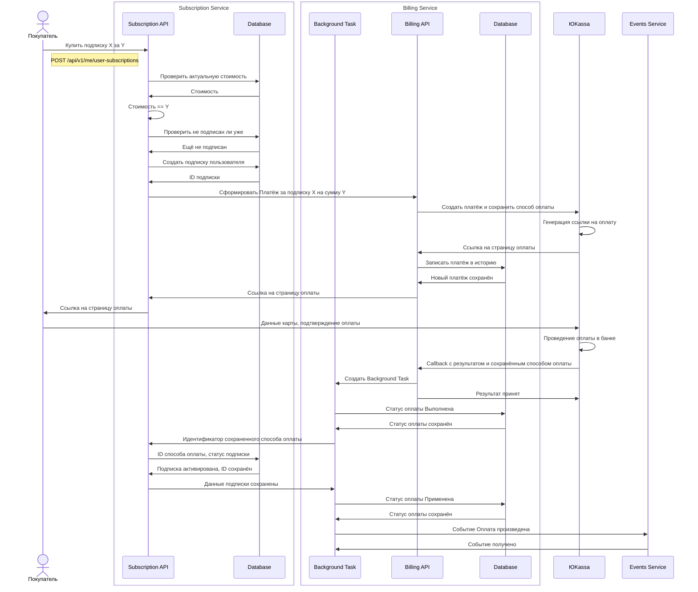
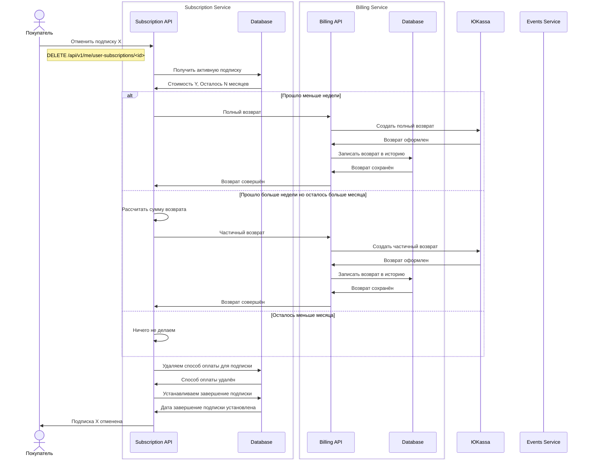
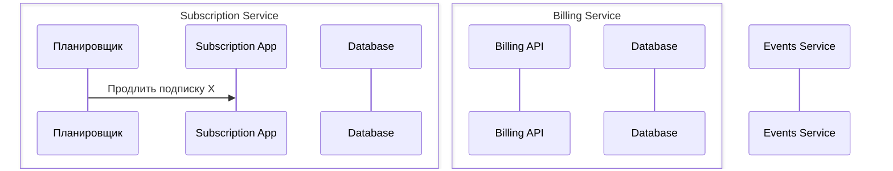
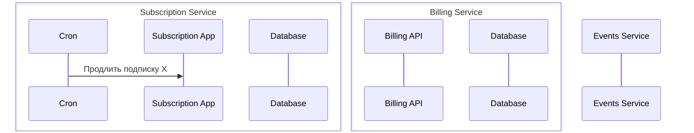

## Администрирование видов подписок
### Запрос всех видов подписок

### Создание нового вида подписок

### Изменение вида подписки

## Работа с подписками пользователя
### Пользователь получает свои подписки

### Пользователь подписывается и оплачивает подписку

## Отмена подписки

## Автоматическое продление подписки

## Проверять истекающие подписки и предупреждать об предстоящей оплате

## Проверять истекающие подписки, формирует запрос на оплату в сервис биллинга и уведомлять о резульате

## Проверять истекшие подписки и уведомлять об неудаче и напоминать об оплате
