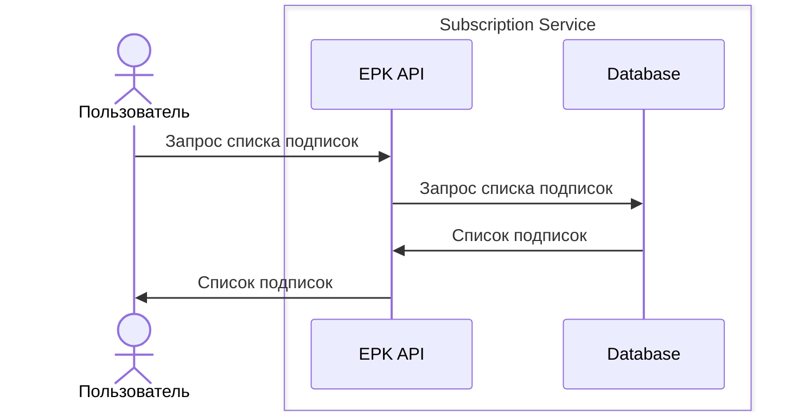
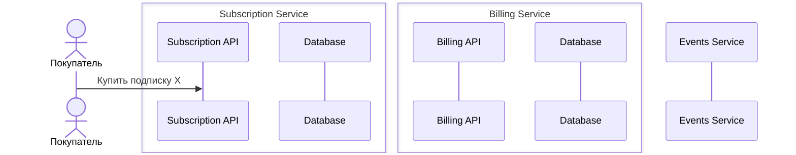
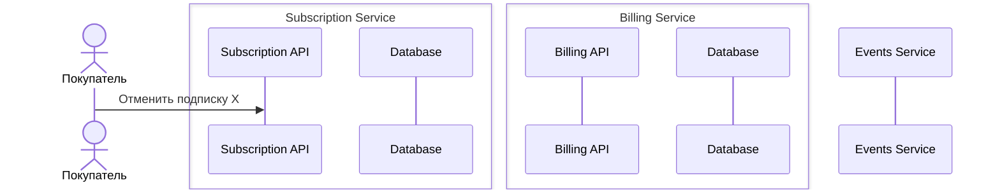
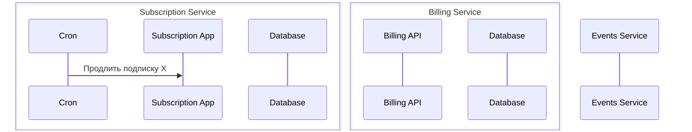

## Получение сведений о подписках

```mermaid
sequenceDiagram
    actor User as Пользователь
    box Subscription Service
        participant API as EPK API
        participant DB as Database
    end
    User->>API: Запрос списка подписок
    API->>DB: Запрос списка подписок
    DB->>API: Список подписок
    API->>User: Список подписок
```
## Оплата подписки

```mermaid
sequenceDiagram
    actor User as Покупатель
    box Subscription Service
        participant SubAPI as Subscription API
        participant SubDB as Database
    end
    box Billing Service
        participant BilAPI as Billing API
        participant BilDB as Database
    end
    participant Events as Events Service
    User->>SubAPI: Купить подписку X
```
## Отмена подписки

```mermaid
sequenceDiagram
    actor User as Покупатель
    box Subscription Service
        participant SubAPI as Subscription API
        participant SubDB as Database
    end
    box Billing Service
        participant BilAPI as Billing API
        participant BilDB as Database
    end
    participant Events as Events Service
    User->>SubAPI: Отменить подписку X
```
## Продление подписки

```mermaid
sequenceDiagram
    box Subscription Service
        participant Cron
        participant SubApp as Subscription App
        participant SubDB as Database
    end
    box Billing Service
        participant BilAPI as Billing API
        participant BilDB as Database
    end
    participant Events as Events Service
    Cron->>SubApp: Продлить подписку X
```