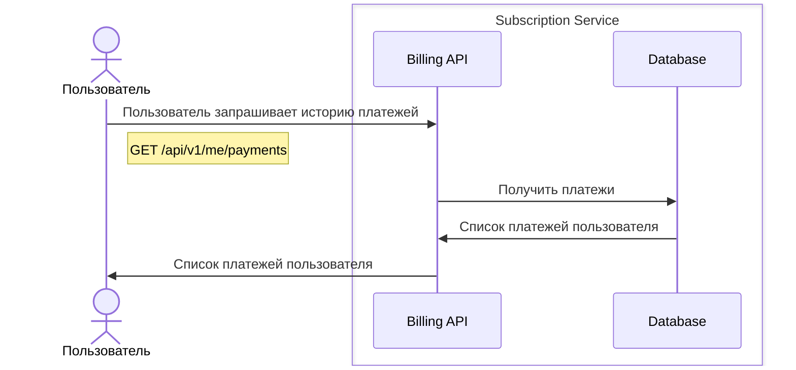

## Работа с платежами пользователя
### Пользователь получает историю платежей

```mermaid
sequenceDiagram
    actor User as Пользователь
    box Subscription Service
        participant API as Billing API
        participant DB as Database
    end

    User->>API: Пользователь запрашивает историю платежей
    Note right of User: GET /api/v1/me/payments
    API->>DB: Получить платежи
    DB->>API:  Список платежей пользователя
    API->>User: Список платежей пользователя
```
