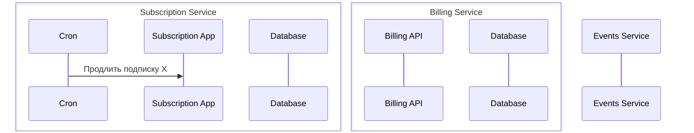

## Проверять истекающие подписки и предупреждать об предстоящей оплате

```mermaid
sequenceDiagram
    box Subscription Service
        participant Cron
        participant SubApp as Subscription App
        participant SubDB as Database
    end
    box Billing Service
        participant BillAPI as Billing API
        participant BillDB as Database
    end
    participant Events as Events Service
    Cron->>SubApp: Продлить подписку X
```
## Проверять истекшие подписки и уведомлять об неудаче и напоминать об оплате

```mermaid
sequenceDiagram
 box Subscription Service
        participant Cron
        participant SubApp as Subscription App
        participant SubDB as Database
    end
    box Billing Service
        participant BillAPI as Billing API
        participant BillDB as Database
    end
    participant Events as Events Service
    Cron->>SubApp: Продлить подписку X
```