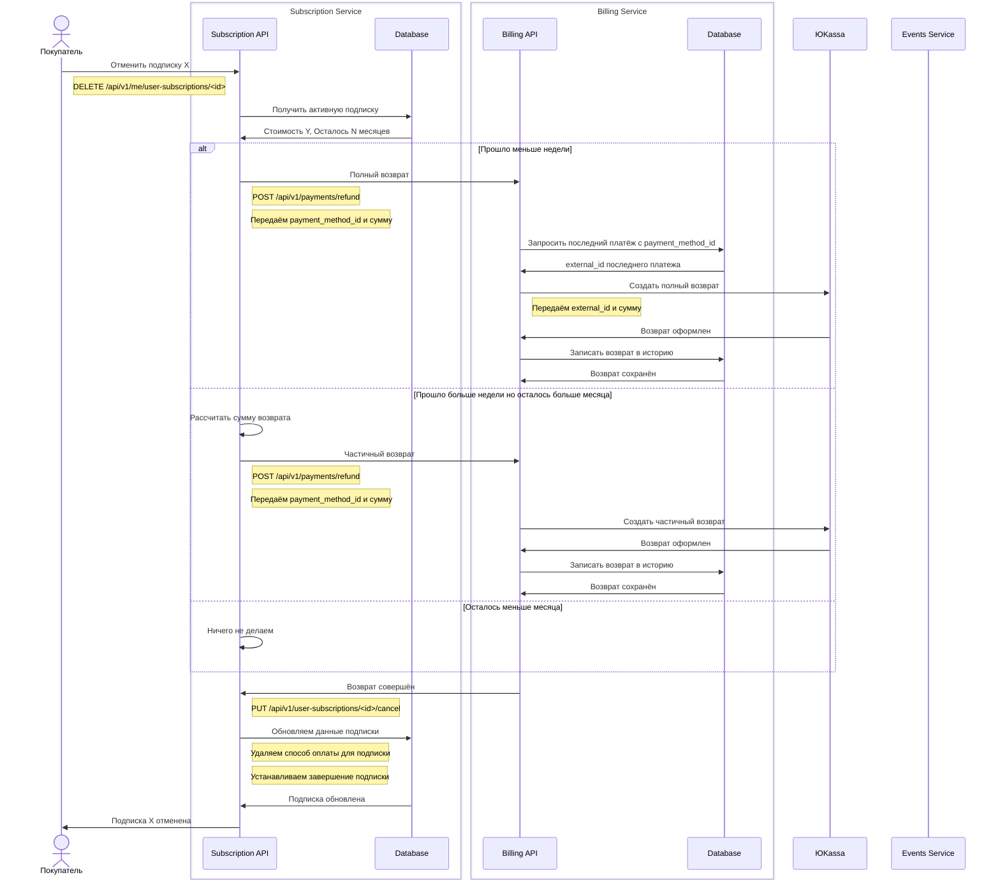

## Работа с подписками пользователя
## Отмена подписки

```mermaid
sequenceDiagram
    actor User as Покупатель
    box Subscription Service
        participant SubAPI as Subscription API
        participant SubDB as Database
    end
    box Billing Service
        participant BillAPI as Billing API
        participant BillDB as Database
    end
    participant YooKassa as ЮKassa
    participant Events as Events Service

    User->>SubAPI: Отменить подписку X
    Note right of User: DELETE /api/v1/me/user-subscriptions/<id>
    SubAPI->>SubDB: Получить активную подписку
    SubDB->>SubAPI: Стоимость Y, Осталось N месяцев
    alt Прошло меньше недели
        SubAPI->>BillAPI: Полный возврат
        Note right of SubAPI: POST /api/v1/payments/refund
        Note right of SubAPI: Передаём payment_method_id и сумму
        BillAPI->>BillDB: Запросить последний платёж с payment_method_id
        BillDB->>BillAPI: external_id последнего платежа
        BillAPI->>YooKassa: Создать полный возврат
        Note right of BillAPI: Передаём external_id и сумму
        YooKassa->>BillAPI: Возврат оформлен 
        BillAPI->>BillDB: Записать возврат в историю
        BillDB->>BillAPI: Возврат сохранён
    else Прошло больше недели но осталось больше месяца
        SubAPI->>SubAPI: Рассчитать сумму возврата
        SubAPI->>BillAPI: Частичный возврат
        Note right of SubAPI: POST /api/v1/payments/refund
        Note right of SubAPI: Передаём payment_method_id и сумму
        BillAPI->>YooKassa: Создать частичный возврат
        YooKassa->>BillAPI: Возврат оформлен
        BillAPI->>BillDB: Записать возврат в историю
        BillDB->>BillAPI: Возврат сохранён
    else Осталось меньше месяца
        SubAPI->>SubAPI: Ничего не делаем
    end
    BillAPI->>SubAPI: Возврат совершён
    Note right of SubAPI: PUT /api/v1/user-subscriptions/<id>/cancel
    SubAPI->>SubDB: Обновляем данные подписки
    Note right of SubAPI: Удаляем способ оплаты для подписки
    Note right of SubAPI: Устанавливаем завершение подписки
    SubDB->>SubAPI: Подписка обновлена
    SubAPI->>User: Подписка X отменена
```