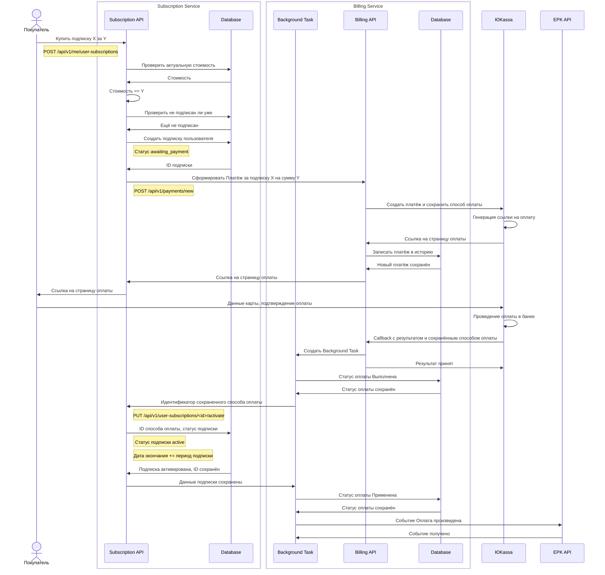

## Работа с подписками пользователя
### Пользователь подписывается и оплачивает подписку

```mermaid
sequenceDiagram
    actor User as Покупатель
    box Subscription Service
        participant SubAPI as Subscription API
        participant SubDB as Database
    end
    box Billing Service
        participant BillBGround as Background Task
        participant BillAPI as Billing API
        participant BillDB as Database
    end
    participant YooKassa as ЮKassa
    participant EPKAPI as EPK API

    User->>SubAPI: Купить подписку X за Y
    Note right of User: POST /api/v1/me/user-subscriptions
    SubAPI->>SubDB: Проверить актуальную стоимость
    SubDB->>SubAPI: Стоимость
    SubAPI->>SubAPI: Стоимость == Y
    SubAPI->>SubDB: Проверить не подписан ли уже
    SubDB->>SubAPI: Ещё не подписан
    SubAPI->>SubDB: Создать подписку пользователя
    Note right of SubAPI: Статус awaiting_payment
    SubDB->>SubAPI: ID подписки

    SubAPI->>BillAPI: Сформировать Платёж за подписку X на сумму Y
    Note right of SubAPI: POST /api/v1/payments/new
    BillAPI->>YooKassa: Создать платёж и сохранить способ оплаты
    YooKassa->>YooKassa: Генерация ссылки на оплату
    YooKassa->>BillAPI: Ссылка на страницу оплаты
    BillAPI->>BillDB: Записать платёж в историю
    BillDB->>BillAPI: Новый платёж сохранён
    BillAPI->>SubAPI: Ссылка на страницу оплаты
    SubAPI->>User: Ссылка на страницу оплаты

    User->>YooKassa: Данные карты, подтверждение оплаты
    YooKassa->>YooKassa: Проведение оплаты в банке
    YooKassa->>BillAPI: Callback с результатом и сохранённым способом оплаты
    BillAPI->>BillBGround: Создать Background Task
    BillAPI->>YooKassa: Результат принят

    BillBGround->>BillDB: Статус оплаты Выполнена
    BillDB->>BillBGround: Статус оплаты сохранён
    BillBGround->>SubAPI: Идентификатор сохраненного способа оплаты
    Note right of SubAPI: PUT /api/v1/user-subscriptions/<id>/activate
    SubAPI->>SubDB: ID способа оплаты, статус подписки
    Note right of SubAPI: Статус подписки active
    Note right of SubAPI: Дата окончания += период подписки 
    SubDB->>SubAPI: Подписка активирована, ID сохранён
    SubAPI->>BillBGround: Данные подписки сохранены
    BillBGround->>BillDB: Статус оплаты Применена
    BillDB->>BillBGround: Статус оплаты сохранён
    BillBGround->>EPKAPI: Событие Оплата произведена
    EPKAPI->>BillBGround: Событие получено
```