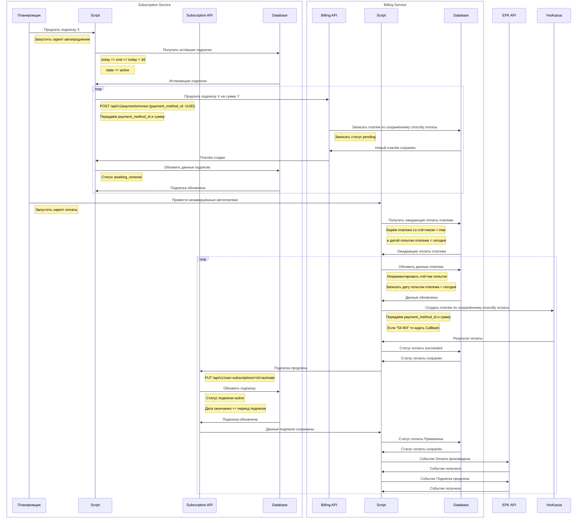

## Работа с подписками пользователя
## Автоматическое продление подписки

```mermaid
sequenceDiagram
    box Subscription Service
        participant Cron as Планировщик
        participant SubApp as Script
        participant SubAPI as Subscription API
        participant SubDB as Database
    end
    box Billing Service
        participant BillAPI as Billing API
        participant BillApp as Script
        participant BillDB as Database
    end
    participant EPKAPI as EPK API
    Cron->>SubApp: Продлить подписку X
    Note right of Cron: Запустить скрипт автопродления
    SubApp->>SubDB: Получить истёкшие подписки 
    Note right of SubApp: today <= end <= today + 3d
    Note right of SubApp: state == active
    SubDB->>SubApp: Истекающие подписки
    loop
        SubApp->>BillAPI: Продлить подписку X на сумму Y
        Note right of SubApp: POST /api/v1/payments/renew {payment_method_id: UUID}
        Note right of SubApp: Передаём payment_method_id и сумму
        BillAPI->>BillDB: Записать платёж по сохранённому способу оплаты
        Note right of BillAPI: Записать статус pending
        BillDB->>BillAPI: Новый платёж сохранён
        BillAPI->>SubApp: Платёж создан
        SubApp->>SubDB: Обновить данные подписки
        Note right of SubApp: Статус awaiting_renewal
        SubDB->>SubApp: Подписка обновлена
    end

    Cron->>BillApp: Провести незавершённые автоплатежи
    Note right of Cron: Запустить скрипт оплаты
    BillApp->>BillDB: Получить ожидающие оплаты платежи
    Note right of BillApp: Берём платежи со счётчиком < max
    Note right of BillApp: и датой попытки платежа < сегодня
    BillDB->>BillApp: Ожидающие оплаты платежи

    loop
        BillApp->>BillDB: Обновить данные платежа
        Note right of BillApp: Инкрементировать счётчик попыток
        Note right of BillApp: Записать дату попытки платежа = сегодня
        BillDB->>BillApp: Данные обновлены
        BillApp->>YooKassa: Создать платёж по сохранённому способу оплаты
        Note right of BillApp: Передаём payment_method_id и сумму
        Note right of BillApp: Если "54-ФЗ" то ждать Callback
        YooKassa->>BillApp: Результат оплаты
    
        BillApp->>BillDB: Статус оплаты succeeded
        BillDB->>BillApp: Статус оплаты сохранён
        BillApp->>SubAPI: Подписка продлена
    Note right of SubAPI: PUT /api/v1/user-subscriptions/<id>/activate
        SubAPI->>SubDB: Обновить подписку
        Note right of SubAPI: Статус подписки active
        Note right of SubAPI: Дата окончания += период подписки 
        SubDB->>SubAPI: Подписка обновлена
        SubAPI->>BillApp: Данные подписки сохранены
        BillApp->>BillDB: Статус оплаты Применена
        BillDB->>BillApp: Статус оплаты сохранён
        BillApp->>EPKAPI: Событие Оплата произведена
        EPKAPI->>BillApp: Событие получено
        BillApp->>EPKAPI: Событие Подписка продлена
        EPKAPI->>BillApp: Событие получено
    end
```