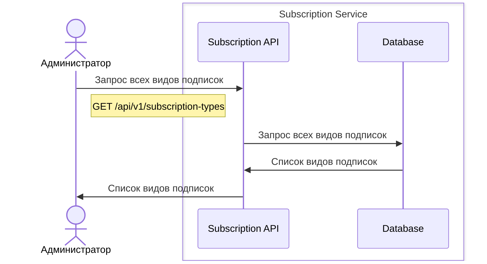
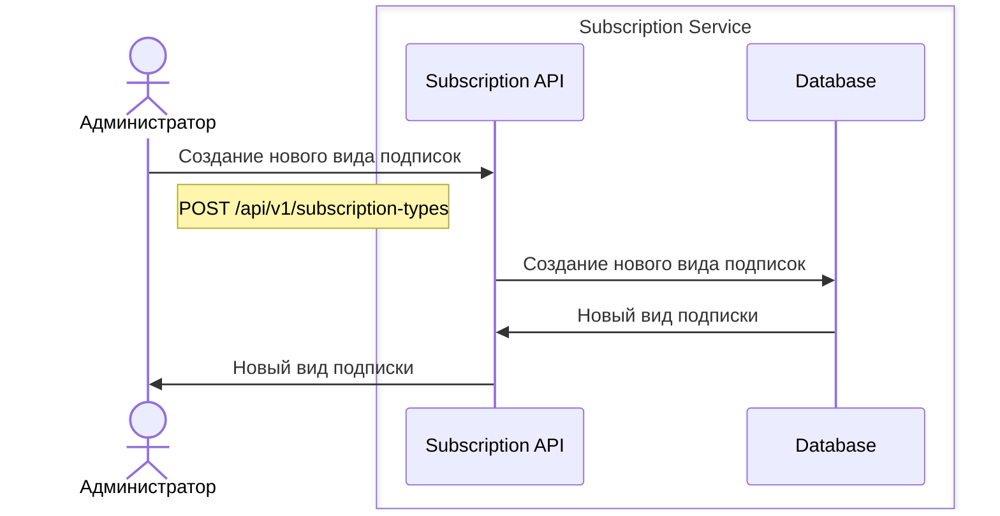
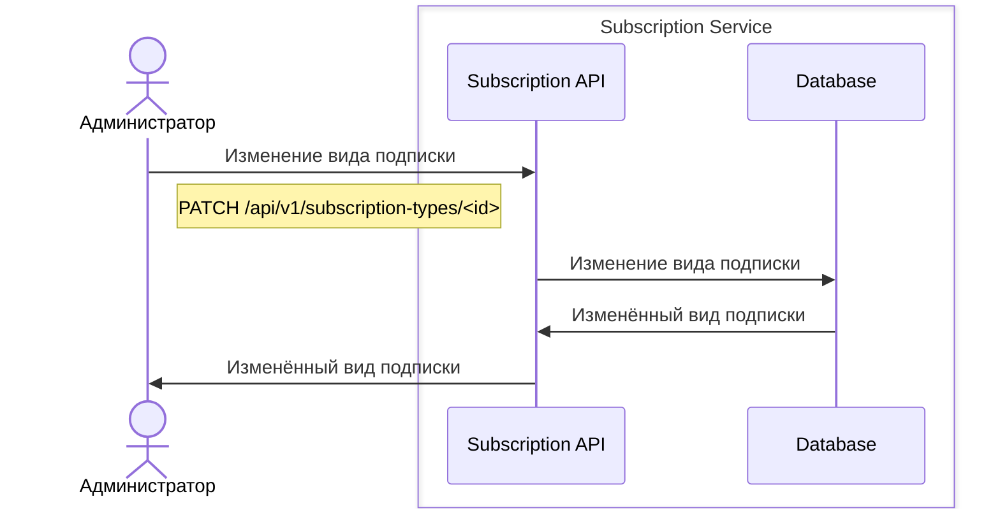

## Администрирование видов подписок
### Запрос всех видов подписок

```mermaid
sequenceDiagram
    actor User as Администратор
    box Subscription Service
        participant API as Subscription API
        participant DB as Database
    end

    User->>API: Запрос всех видов подписок
    Note right of User: GET /api/v1/subscription-types
    API->>DB: Запрос всех видов подписок
    DB->>API: Список видов подписок
    API->>User: Список видов подписок
```
### Создание нового вида подписок

```mermaid
sequenceDiagram
    actor User as Администратор
    box Subscription Service
        participant API as Subscription API
        participant DB as Database
    end
    
    User->>API: Создание нового вида подписок
    Note right of User: POST /api/v1/subscription-types
    API->>DB: Создание нового вида подписок
    DB->>API: Новый вид подписки
    API->>User: Новый вид подписки
```
### Изменение вида подписки

```mermaid
sequenceDiagram
    actor User as Администратор
    box Subscription Service
        participant API as Subscription API
        participant DB as Database
    end
    
    User->>API: Изменение вида подписки
    Note right of User: PATCH /api/v1/subscription-types/<id>
    API->>DB: Изменение вида подписки
    DB->>API: Изменённый вид подписки
    API->>User: Изменённый вид подписки
```
