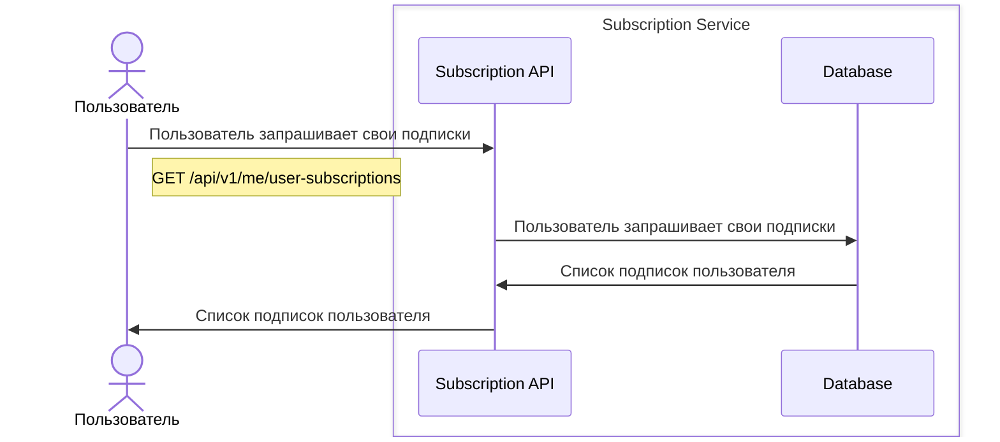

## Работа с подписками пользователя
### Пользователь получает свои подписки

```mermaid
sequenceDiagram
    actor User as Пользователь
    box Subscription Service
        participant API as Subscription API
        participant DB as Database
    end

    User->>API: Пользователь запрашивает свои подписки
    Note right of User: GET /api/v1/me/user-subscriptions
    API->>DB: Пользователь запрашивает свои подписки
    DB->>API:  Список подписок пользователя
    API->>User: Список подписок пользователя
```