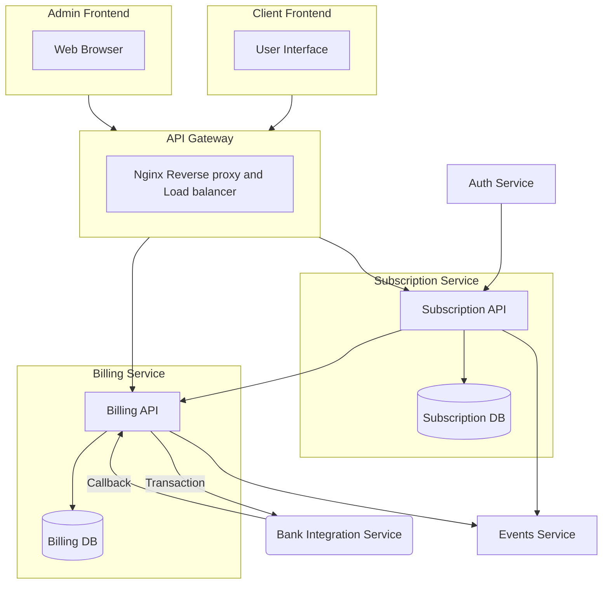

# Solution architecture for the Practix online cinema

```mermaid
flowchart TB
    subgraph clientFrontend[Client Frontend]
        userInterface[User Interface]
    end
    
    subgraph adminFrontend[Admin Frontend]
        webBrowser[Web Browser]
    end

    subgraph apiGateway[API Gateway]
        Nginx[Nginx Reverse proxy and Load balancer]
    end

    subgraph SubscriptionService[Subscription Service]
        direction TB
        subscriptionAPI[Subscription API]
        SubscriptionDB[(Subscription DB)]
        subscriptionAPI --> SubscriptionDB
    end

    subgraph Billing[Billing Service]
        direction TB
        billingAPI[Billing API]
        billingDB[(Billing DB)]
        billingAPI --> billingDB
    end
    
    apiGateway --> subscriptionAPI
    apiGateway --> billingAPI

    authService[Auth Service] --> subscriptionAPI
    billingAPI --Transaction--> bankService(Bank Integration Service)
    bankService --Callback--> billingAPI
    subscriptionAPI --> billingAPI

    subscriptionAPI --> EventsService[Events Service]
    billingAPI --> EventsService

    clientFrontend --> apiGateway
    adminFrontend --> apiGateway


```
